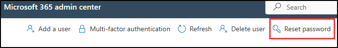

---
lab:
  title: Configuração do laboratório — Preparar seu ambiente para administração
  module: Lab setup
---

## Locatários do WWL – Termos de uso

Se você estiver recebendo um locatário como parte de uma entrega de treinamento com instrutor, observe que o locatário é disponibilizado com a finalidade de dar suporte aos laboratórios práticos no treinamento com instrutor.

Os locatários não devem ser compartilhados ou usados para fins fora dos laboratórios práticos. O locatário usado neste curso é um locatário de avaliação e não pode ser usado ou acessado após o fim da aula e não está qualificado para extensão.

Os locatários não podem ser convertidos em uma assinatura paga. Os locatários obtidos como parte deste curso permanecem a propriedade da Microsoft Corporation e reservamos o direito de obter acesso e a qualquer momento.

# Configuração do laboratório — Preparar seu ambiente para administração

Neste laboratório, você configurará e preparará seu ambiente para tarefas de administração. Você ativará os recursos necessários, configurará permissões administrativas e garantirá a configuração adequada dos principais elementos.

**Tarefas:**

1. Habilitar a Auditoria no portal do Microsoft Purview
1. Definir senhas de usuário para exercícios de laboratório
1. Habilitar a integração de dispositivos
1. Habilitar a análise de risco interno

## Tarefa 1 – Habilitar a Auditoria no portal do Microsoft Purview

Nesta tarefa, você habilitará a Auditoria no portal do Microsoft Purview para monitorar as atividades do portal.

1. Entre na VM do Cliente 1 (SC-401-CL1) como a conta **SC-401-CL1\admin** e entre no Microsoft 365 com a conta de Administrador do MOD.

1. No Microsoft Edge, navegue até o portal do Microsoft Purview, `https://purview.microsoft.com`, e faça logon.

1. Uma mensagem sobre o novo portal do Microsoft Purview aparecerá na tela. Selecione **Introdução** para acessar o novo portal.

    

1. Selecione **Soluções** na barra lateral esquerda e escolha **Auditoria**.

1. Na página **Pesquisar**, selecione a barra **Iniciar gravação de atividades de usuário e administrador** para habilitar o registro em log de auditoria.

    

1. Depois de selecionar esta opção, a barra azul desaparecerá desta página.

<!----- PowerShell instructions

1. Open an elevated Terminal window by selecting the Windows button with the right mouse button and then select **Terminal (Admin)**.

1. Run the **Install Module** cmdlet in the terminal window to install the latest **Exchange Online PowerShell** module version:

    ```powershell
    Install-Module ExchangeOnlineManagement
    ```

1. Confirm the NuGet provider prompt  by typing **Y** for Yes and press **Enter**.

1. Confirm the Untrusted repository security dialog with **Y** for Yes and press **Enter**.  This process may take some time to complete.

1. Run the **Set-ExecutionPolicy** cmdlet to change your execution policy and press **Enter**

    ```powershell
    Set-ExecutionPolicy -ExecutionPolicy RemoteSigned -Scope CurrentUser
    ```

1. Close the PowerShell window.

1. Open a regular (non-elevated) PowerShell window by right-clicking the Windows button and selecting **Terminal**.

1. Run the **Connect-ExchangeOnline** cmdlet to use the Exchange Online PowerShell module and connect to your tenant:

    ```powershell
    Connect-ExchangeOnline
    ```

1. When the **Sign in** window is displayed, sign in as `admin@WWLxZZZZZZ.onmicrosoft.com` (where ZZZZZZ is your unique tenant ID provided by your lab hosting provider). Admin's password should be provided by your lab hosting provider.

1. To check if Audit is enabled, run the **Get-AdminAuditLogConfig** cmdlet:

    ```powershell
    Get-AdminAuditLogConfig | FL UnifiedAuditLogIngestionEnabled
    ```

1. If _UnifiedAuditLogIngestionEnabled_ returns false, then Audit is disabled.

1. To enable the Audit log, run the **Set-AdminAuditLogConfig** cmdlet and set the **UnifiedAuditLogIngestionEnabled** to _true_:

    ```powershell
    Set-AdminAuditLogConfig -UnifiedAuditLogIngestionEnabled $true
    ```

1. To verify that Audit is enabled, run the **Get-AdminAuditLogConfig** cmdlet again:

    ```powershell
    Get-AdminAuditLogConfig | FL UnifiedAuditLogIngestionEnabled
    ```

1. _UnifiedAuditLogIngestionEnabled_ should return _true_ to let you know Audit is enabled.

-->

Você habilitou a auditoria no Microsoft 365.

## Tarefa 2 — Definir senhas de usuário para exercícios de laboratório

Nesta tarefa, você definirá senhas para as contas de usuário necessárias para os laboratórios.

1. Entra na VM do Cliente 1 (SC-401-CL1) como a conta **SC-401-CL1\admin**. A senha deve ser fornecida pelo seu provedor de hospedagem de laboratório.

1. Abra o **Microsoft Edge** e navegue até **`https://admin.microsoft.com`** para entrar no centro de administração do Microsoft 365 como Administrador MOD, `admin@WWLxZZZZZZ.onmicrosoft.com` (em que ZZZZZZ é a sua ID de locatário exclusiva fornecida pelo seu provedor de hospedagem do laboratório).

1. No painel de navegação à esquerda, expanda **Usuários** e selecione **Usuários ativos**.

1. Marque a caixa de seleção à esquerda de **Joni Sherman**, **Lynne Robbins** e **Megan Bowen**.

   Essas contas serão usadas nos exercícios de laboratório.

   

1. Selecione o botão **Redefinir senha** na navegação superior para redefinir as três senhas.

   

1. Na página de submenu **Redefinir senha** à direita, verifique se ambas as caixas de seleção estão desmarcadas.

   Isso garantirá que você possa selecionar uma senha para os três usuários que estão sendo usados para exercícios e que essas senhas não precisem ser redefinidas quando você entrar pela primeira vez.

1. No campo **Senha**, digite uma senha que você possa lembrar para redefinir as senhas de usuário a serem usadas em exercícios futuros.

1. Selecione o botão **Redefinir senha** na parte inferior da página **Redefinir senha**.

1. Na página **As senhas foram redefinidas**, você verá as três contas de usuário que foram redefinidas. Na parte inferior desta página de submenu, selecione **Fechar**.

Você redefiniu com sucesso as senhas para exercícios de laboratório.

## Tarefa 3 – Habilitar a integração do dispositivo

Nesta tarefa, você habilitará a integração de dispositivos para sua organização.

1. Ainda é necessário estar conectado à VM do Cliente 1 (SC-401-CL1) como a conta **SC-401-CL1\admin** e conectado como Administrador MOD no Microsoft 365.

1. No **Microsoft Edge**, navegue até**`https://purview.microsoft.com`** para fazer login no Microsoft Purview e selecione **Configurações** na barra lateral esquerda.

1. Na barra lateral esquerda, expanda **Integração de dispositivos** e selecione **Dispositivos**.

1. Na página **Dispositivos**, selecione **Ativar integração de dispositivos** e, em seguida, selecione **Ok** para habilitar a integração de dispositivos.

1. Quando solicitado, selecione **OK** para confirmar se o monitoramento do dispositivo está sendo ativado.

Agora você habilitou a integração de dispositivos e pode começar a integrar dispositivos a serem protegidos com políticas de DLP de ponto de extremidade. O processo de habilitação do recurso pode levar até 30 minutos.

## Tarefa 4 – Habilitar a análise de riscos internos e o compartilhamento de dados

Nesta tarefa, você habilitará a análise e o compartilhamento de dados para o Gerenciamento de risco interno.

1. Ainda é necessário estar conectado à VM do Cliente 1 (SC-401-CL1) como a conta **SC-401-CL1\admin** e conectado como Administrador MOD no Microsoft Purview.

1. No Microsoft Purview, navegue até **Configurações** > **Gerenciamento de risco interno** > **Análise**.

1. Alterne essas configurações para **Ativado**:

   - **Mostrar insights no nível do locatário**

   - **Mostrar insights no nível do usuário**

1. Escolha **Salvar** na parte inferior da página.

1. No painel de navegação à esquerda, clique em **Compartilhamento de dados**.

1. Na seção Compartilhamento de dados, alterne **Compartilhar detalhes de risco do usuário com outras soluções de segurança** para **Ativado**.

1. Escolha **Salvar** na parte inferior da página.

Você habilitou a análise e o compartilhamento de dados para Gerenciamento de risco interno.

## Tarefa 5 - Inicializar o Microsoft Defender XDR

Nesta tarefa, você abrirá o Microsoft Defender e aguardará a conclusão da inicialização do Microsoft Defender XDR.

1. Ainda é necessário estar conectado à VM do Cliente 1 (SC-401-CL1) como a conta **SC-401-CL1\admin** e conectado como Administrador MOD no Microsoft Purview.

1. No **Microsoft Edge**, navegue até**`https://security.microsoft.com/`** para abrir o Microsoft Defender.

1. No painel de navegação, selecione **Investigação e resposta** > **Incidentes e alertas** > **Incidentes**.

1. Você verá uma mensagem informando que o Microsoft Defender XDR está sendo preparado. Esse processo é executado automaticamente e pode levar alguns minutos.

   

O Microsoft Defender XDR está sendo inicializado. Você pode continuar com outras tarefas enquanto a configuração é concluída.
