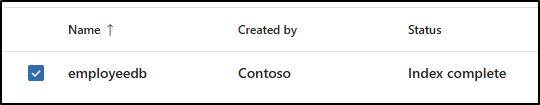

---
lab:
  title: Exercício 2 — Criar e gerenciar tipos de informações confidenciais
  module: Module 1 - Implement Information Protection
---


# Laboratório 1 — Exercício 2 — Criar e gerenciar tipos de informações confidenciais

Joni Sherman, administradora de segurança da informação da Contoso Ltd., está atualizando a estratégia de proteção de informações da organização após incidentes anteriores envolvendo o compartilhamento não intencional de dados pessoais em tíquetes de suporte. Ela precisa criar e testar tipos de informações confidenciais personalizadas que ajudem a detectar IDs de funcionários e referências a informações pessoais de saúde em documentos e emails.

**Tarefas:**

1. Criar tipos de informação confidencial personalizada
1. Modificar o nível de confiança para reduzir falsos positivos
1. Criar um grupo de segurança e atribuir funções para criar um classificador EDM
1. Criar tipo de informação de classificação baseado em EDM
1. Criar fonte de dados de classificação baseada em EDM
1. Criar dicionário de palavras-chave
1. Testar tipos de informações confidenciais personalizadas

## Tarefa 1 — Criar tipos de informações confidenciais personalizados

Nesta tarefa, você criará um novo tipo de informações confidenciais personalizado que reconhece o padrão de IDs de funcionário perto das palavras-chave "Funcionário" e "ID".

1. Você ainda deve estar conectado à VM do Cliente 1 (SC-401-CL1) como a conta **SC-401-CL1\admin**.

1. No **Microsoft Edge**, navegue até **`https://purview.microsoft.com`** e entre no portal do Microsoft Purview como `JoniS@WWLxZZZZZZ.onmicrosoft.com` (em que ZZZZZZ é seu ID de locatário exclusivo fornecido pelo provedor de hospedagem de laboratório). A senha de Joni foi definida em um exercício anterior.

1. Na barra lateral esquerda, escolha **Soluções** e, em seguida, **Proteção de informações**.

1. Na barra lateral à esquerda, expanda **Classificadores** e escolha **Tipos de informações confidenciais**.

1. Na página **Tipos de informações confidenciais**, escolha **+ Criar tipo de informações confidenciais** para iniciar a configuração do tipo de informações confidenciais.

1. Na página **Nomear seu tipo de informações confidenciais**, insira:

    - **Nome**: `Contoso Employee IDs`
    - **Descrição**: `Pattern for Contoso employee IDs.`

1. Selecione **Avançar**.

1. Na página **Definir padrões para este tipo de informação confidencial**, selecione**Criar padrão**.

1. No painel do submenu **Novo padrão** à direita, escolha **+ Adicionar elemento primário** > **Expressão regular**.

1. No painel do submenu **+ Adicionar uma expressão regular** à direita, insira:

   - **ID**: `Contoso IDs`
   - **Expressão regular**: `[A-Z]{3}[0-9]{6}`
   - Clique no botão de opção para _Correspondência de cadeia de caracteres_.

1. Clique em **Concluído** na parte inferior do painel de submenu.

1. De volta ao painel do submenu **Novo padrão**, em **Elementos de suporte**, clique no menu suspenso **+ Adicionar elementos de suporte ou grupo de elementos** e escolha **Lista de palavras-chave**.

1. No painel de submenu **Adicionar uma lista de palavras-chave** à direita, insira:

   - **ID**: `Employee ID keywords`
   - **Não diferencia maiúsculas de minúsculas**:

      ```text
      Employee
      ID
      ```

   - Clique no botão de opção para _Correspondência de palavras_

1. Clique em **Concluído** na parte inferior do painel de submenu.

1. De volta ao painel do submenu **Novo padrão**, em **Proximidade de caracteres**, diminua o valor **Detectar elementos primários E de suporte** para `100` caracteres.

1. Clique no botão **Criar** na parte inferior do painel de submenu.

1. De volta à página **Definir padrões para este tipo de informações confidenciais**, clique em **Avançar**.

1. Na página **Escolher o nível de confiança recomendado para mostrar nas políticas de conformidade**, use o valor padrão e clique em **Avançar**.

1. Na página **Revisar configurações e concluir**, revise as configurações e selecione **Criar**. Quando a criação tiver êxito, selecione **Concluído**.

1. Saia da conta de Joni selecionando a foto do perfil de Joni Sherman no canto superior direito. Selecione **Sair** e feche a janela do navegador.

Você criou um novo tipo de informação confidencial para identificar IDs de funcionários no padrão de três caracteres maiúsculos, seis números e as palavras-chave "Funcionário" ou "IDs" dentro de um intervalo de 100 caracteres.

## Tarefa 2 — Modificar o nível de confiança para reduzir falsos positivos

Você recebeu relatórios de que alguns documentos que contém IDs de funcionários não estão sendo detectados. Para melhorar a cobertura de detecção, você reduzirá o nível de confiança do padrão no SIT de IDs de Funcionários da Contoso para que ele seja disparado mesmo quando apenas evidências parciais forem encontradas, aumentando a probabilidade de detecção.

1. Você ainda deve estar na VM do Cliente 1 (SC-401-CL1) como a conta **SC-401-CL1\admin** e no Microsoft Purview como Joni Sherman.

1. No Microsoft Edge, navegue até `https://purview.microsoft.com`.

1. Na navegação à esquerda, selecione **Soluções** > **Proteção de informações** > **Classificadores** > **Tipos de informações confidenciais**.

1. Pesquise por`Contoso Employee IDs` na lista e selecione o nome do SIT para abrir a página de detalhes.

1. Selecione **Editar** na parte superior da página para modificar o SIT.

1. Na página **Nomear seu tipo de informação confidencial**, selecione **Próximo**.

1. Na página **Definir padrões para este tipo de informação confidencial**, expanda **Padrão #1** e revise as configurações.

1. Selecione o ícone do lápis à direita para editar o padrão.

1. No submenu **Editar padrão**, defina a lista suspensa **Nível de confiança** como **Confiança média**, o que permite correspondências com menos evidências de apoio do que a confiança alta.

1. Selecione **Atualizar** na parte inferior do submenu.

1. Selecione **Próximo** até chegar à página **Revisar configurações e concluir**.

1. Selecione **Salvar** e, em seguida, selecione **Concluído** para atualizar seu tipo de informações confidenciais.

Você reduziu com êxito o nível de confiança para aumentar a sensibilidade do SIT personalizado, ajudando a garantir que os documentos com conteúdo de correspondência parcial tenham maior probabilidade de serem sinalizados.

## Tarefa 3 - Criar um grupo de segurança e atribuir funções para criar um classificador EDM

Nesta tarefa, você criará o grupo de funções para criar um classificador EDM e adicionará Joni ao novo grupo de função.

1. Você ainda deve estar conectado à VM do Cliente 1 (SC-401-CL1) como a conta **SC-401-CL1\admin**.

1. Abra o **Microsoft Edge** e navegue até **`https://admin.microsoft.com`**.

1. Quando a página **Escolher uma conta** for exibida, selecione **Usar outra conta** e faça login como **Administrador MOD**`admin@WWLxZZZZZZ.onmicrosoft.com` (onde ZZZZZZ é o sua ID de locatário exclusiva fornecido pelo provedor de hospedagem do seu laboratório). A senha de administrador deve ser fornecida pelo seu provedor de hospedagem do laboratório.

1. No painel esquerdo, expanda **Equipes e grupos** e selecione **Equipes e grupos ativos**.

1. Na parte superior da página **Equipes e grupos ativos**, selecione **Grupos de segurança** e, em seguida, selecione **+ Adicionar um grupo de segurança**.

    

1. Na tela **Configurar o básico**, insira:

    - **Nome**: `EDM_DataUploaders`
    - **Descrição**: `People who upload data for EDM.`

1. Selecione **Avançar**.

1. Na página **Editar configurações**, mantenha as configurações padrão e selecione **Avançar**.

1. Na página **Revisar e concluir adição de grupo**, revise suas configurações e selecione **Criar grupo**.

1. Na página **Grupo EDM_DataUploaders criado**, selecione **Fechar**.

1. De volta à página **Equipes e grupos ativos**, certifique-se de que a guia **Segurança** esteja selecionada na faixa de navegação superior e selecione o botão **Atualizar** para exibir o grupo de segurança recém-criado. Selecione o grupo **EDM_DataUploaders** na lista para abrir o painel submenu **EDM_DataUploaders** à direita.

1. Selecione a guia **Membros** e, em seguida, selecione **Exibir todos e gerenciar membros**.

1. Na página **Membros**, selecione **+ Adicionar membros**.

1. Na página **Adicionar membros**, marque a caixa de seleção à esquerda de **Joni Sherman** e selecione o botão **Adicionar (1)** na parte inferior do painel submenu.

1. Verifique se **Joni Sherman** está listado abaixo de **Membros** e feche o painel submenu selecionando o **X** no canto superior direito do painel submenu.

1. Saia da conta do Administrador do Mod selecionando o ícone MA no canto superior direito da janela, selecionando **Sair** e fechando a janela do navegador.

Você criou com sucesso o grupo **EDM_DataUploaders** e atribuiu a Joni acesso para criar um classificador EDM.

## Tarefa 4 - Criar tipo de informação de classificação baseada em EDM

Nesta tarefa, você criará uma classificação baseada em Correspondência Exata de Dados (EDM) com um esquema de base de dados de dados de funcionários.

1. Abra o **Microsoft Edge** e acesse o portal do Microsoft Purview em `https://purview.microsoft.com`.

1. Quando a página **Escolher uma conta** for exibida, selecione **Joni Sherman** e entre.

1. Navegue até **Proteção de Informações** selecionando **Soluções** > **Proteção de Informações** na barra lateral esquerda.

1. Na página **Proteção de informações**, expanda **Classificadores** e selecione **Classificadores EDM**.

1. Na página **Classificadores EDM**, selecione **+ Criar classificador EDM**.

1. Consulte **Familiarize-se com as etapas necessárias para colocar seu classificador em funcionamento** para entender o fluxo de trabalho para criar classificadores EDM e, em seguida, selecione **Criar classificador EDM**.

1. Na página **Nomear e descrever o classificador EDM**, insira:

    - **Nome**: `employeedb`
    - **Descrição**: `Employee Database schema`

1. Selecione **Avançar**.

1. Na página **Escolher um método para definir seu esquema**, selecione **Definir manualmente sua estrutura de dados** e, em seguida, selecione **Avançar**.

1. Em **Definir colunas que contêm os dados que você deseja detectar**, insira estas colunas:

   - `Name`
   - `BirthDate`
   - `StreetAddress`
   - `EmployeeID`

   Selecione **+ Adicionar coluna** para adicionar os campos restantes até que você tenha quatro colunas no total.

      

1. Selecione **Avançar**.

1. Na página **Selecionar elementos primários**, localize a coluna **EmployeeID**. Expanda o menu suspenso **Modo de correspondência** em que **Token único** é exibido. Selecione o **+** (sinal de adição) em **Escolher um SIT**.

      

1. No painel de submenu **Escolher um tipo de informação confidencial para "EmployeeID"** à direita, na barra de pesquisa, pesquise por `Contoso`.

1. O tipo de informação confidencial **IDs de funcionários da Contoso** criado em uma tarefa anterior será exibido. Marque a caixa de seleção à esquerda desse tipo de informação confidencial e selecione **Salvar**.

1. De volta à página **Selecionar elementos primários**, marque a caixa de seleção à direita de **EmployeeID** para identificar esse campo como um **Elemento primário**.

      

1. Selecione **Avançar**.

1. Em **Definir configurações de dados em colunas selecionadas**, verifique se a alternância está definida como **Sim** para **Usar as mesmas configurações para todas as colunas**.

1. Marque a caixa de seleção Ignorar **delimitadores e pontuação de dados em todas as colunas**.

1. Selecione o menu suspenso em **Escolher delimitadores e pontuação para ignorar** e selecione:

   - _Hífen ('-')_
   - _Ponto ('.')_
   - _Espaço (' ')_
   - _Abrir parêntese ('(')_
   - _Fechar parêntese (')')_

1. Clique em qualquer lugar fora do menu suspenso e selecione **Avançar**.

1. Em **Configurar regras de detecção para elementos primários**, deixe a configuração padrão e selecione **Avançar**.

1. Na página **Examinar configurações e concluir**, selecione **Enviar**.

1. Na página **Você criou um classificador EDM**, certifique-se de capturar o **Nome do esquema** a ser usado na próxima tarefa.

      

1. Depois de capturar o nome do esquema, selecione **Concluído**.

1. Deixe o navegador aberto com o portal do Microsoft Purview.

Você criou um novo tipo de informação confidencial de classificação baseada em EDM para identificar dados de funcionários de uma fonte de arquivo de banco de dados.

## Tarefa 5 — Criar fonte de dados de classificação baseada em EDM

Nesta tarefa, você fará hash e carregará os dados reais para o tipo de informação confidencial de classificação baseada em EDM por meio da ferramenta Agente de Upload do EDM.

1. Você ainda deve estar na VM do Cliente 1 (SC-401-CL1) como a conta **SC-401-CL1\admin** e no Microsoft 365 como **Joni Sherman**.

1. No **Microsoft Edge**, navegue até **`https://go.microsoft.com/fwlink/?linkid=2088639`** para baixar o agente de upload do EDM.

1. Quando o download for concluído, selecione **Abrir arquivo** na janela do navegador Microsoft Edge para abrir o assistente de **Configuração do Agente de Upload de Correspondência Exata de Dados da Microsoft**.

1. Na página **Boas-vindas ao Assistente de Configuração do Agente de Upload de Correspondência Exata de Dados da Microsoft**, selecione **Avançar**.

1. Na página **Contrato de Licença do usuário-final**, marque a caixa de seleção **Aceito os termos do Contrato de Licença** e clique em **Avançar**.

1. Na página **Pasta de Destino** , não altere o caminho de destino padrão e selecione **Avançar**.

1. Na página **Pronto para instalar o Agente de Upload de Correspondência Exata de Dados da Microsoft**, selecione **Instalar**.

1. Se aparecer a janela **Controle de Conta de Usuário**, selecione **Sim** para permitir que o aplicativo faça alterações no dispositivo.

1. Quando a instalação for concluída, selecione **Concluir** na página **Concluído o Assistente de Configuração do Agente de Upload de Correspondência Exata de Dados da Microsoft**.

1. Na barra de tarefas, pesquise `Notepad` no campo de pesquisa. Selecione o aplicativo **Bloco de notas** na seção **Melhor correspondência** da pesquisa.

1. No Bloco de Notas, insira:

    ``` text
    Name,Birthdate,StreetAddress,EmployeeID
    Joni Sherman,01.06.1980,1 Main Street,CSO123456
    Lynne Robbins,31.01.1985,2 Secondary Street,CSO654321
    ```

1. No Bloco de Notas, selecione **Arquivo** e **Salvar como** para salvar o arquivo.

1. Selecione **Documentos** no painel esquerdo e digite `EmployeeData.csv` como o **Nome do arquivo** e selecione **Salvar**.

1. Feche a janela do Bloco de Notas.

1. Clique com o botão direito do mouse no símbolo do Windows na barra de tarefas e selecione **Terminal (Admin)**.

1. Se aparecer a janela **Controle de Conta de Usuário**, selecione **Sim** para permitir que o aplicativo faça alterações no dispositivo.

1. Na janela do terminal, navegue até o diretório do Agente de Upload do EDM:

    ``` powershell
    cd "C:\Program Files\Microsoft\EdmUploadAgent"
    ```

1. Autorize com sua conta para carregar o banco de dados no locatário executando este cmdlet:

    ``` powershell
    .\EdmUploadAgent.exe /Authorize
    ```

1. Quando a janela **Selecionar uma conta** for exibida, entre como `JoniS@WWLxZZZZZZ.onmicrosoft.com` (em que ZZZZZZ é sua ID de locatário exclusiva fornecida pelo provedor de hospedagem de laboratório). A senha de Joni foi definida em um exercício anterior.

1. De volta à janela do terminal, baixe a definição de esquema de banco de dados do tipo de informação confidencial de classificação com base em EDM executando esse script no PowerShell. Para o **DataStoreName**, aqui você usará o nome do esquema salvo na tarefa anterior.

    ``` powershell
    .\EdmUploadAgent.exe /SaveSchema /DataStoreName employeedbSchema /OutputDir "C:\Users\Admin\Documents\"
    ```

    Você deve receber uma mensagem informando que os comandos foram concluídos com êxito.

    > [!Note] **Observação:** em caso de falha do último comando, possivelmente levará mais tempo até que a associação de grupo **EDM_DataUploaders** seja aplicada. Pode levar até uma hora até que seja possível baixar o arquivo de esquema.  Em caso de falha, prossiga para a próxima tarefa e retorne a esta etapa mais tarde.

1. Faça o hash do arquivo de banco de dados e carregue-o no tipo de informação confidencial de classificação baseada em EDM executando o seguinte script no PowerShell:

    ``` powershell
    .\EdmUploadAgent.exe /UploadData /DataStoreName employeedbSchema /DataFile "C:\Users\Admin\Documents\EmployeeData.csv" /HashLocation "C:\Users\Admin\Documents\" /Schema "C:\Users\Admin\Documents\employeedbSchema.xml"
    ```

    Você deve receber uma mensagem informando que os comandos foram concluídos com êxito.

1. Verifique o progresso do upload com este comando:

    ``` powershell
    .\EdmUploadAgent.exe /GetSession /DataStoreName employeedbSchema
    ```

1. Na janela do terminal, quando o status for **Concluído**, seus dados de EDM estarão prontos para uso.

    Como alternativa, você também pode atualizar a janela de **Classificadores EDM** no portal do Microsoft Purview para verificar o status do hash. Depois que o status é definido como **Índice concluído**, o hash é concluído.

    > [!Note] **Observação:** esse processo pode demorar algum tempo. Talvez seja necessário executar o script GetSession ou atualizar a página de classificadores EDM várias vezes antes que o status indique que o hash foi concluído.

    

    

1. Feche a janela do terminal.

Você fez hash e carregou com êxito um arquivo de banco de dados para um tipo de informação confidencial de classificação com base em EDM.

## Tarefa 6: criar dicionário de palavras-chave

Várias violações de vazamento de informações pessoais aconteceram quando os usuários enviaram emails depois que os colegas relataram licença médica. Nesses casos, o motivo da doença ou enfermidade foi divulgado. Não queremos que isso aconteça. Nesta tarefa, você criará um dicionário de palavras-chave para evitar o vazamento de informações pessoais em emails.

1. Você ainda deve estar na VM do Cliente 1 (SC-401-CL1) como a conta **SC-401-CL1\admin** e no Microsoft 365 como **Joni Sherman**.

1. O portal do Microsoft Purview ainda deve estar na página de classificadores EDM no Microsoft Edge. Caso contrário, no Microsoft Edge, vá até `https://purview.microsoft.com` > **Soluções** > **Proteção das informações**.

1. Na barra lateral à esquerda, expanda **Classificadores** e escolha **Tipos de informações confidenciais**.

1. Selecione **+ Criar tipo de informação confidencial** para abrir a configuração de um novo tipo de informação confidencial.

1. Na página **Nomear seu tipo de informações confidenciais**, insira:

    - **Nome**: `Contoso Diseases List`
    - **Descrição**: `List of possible diseases of employees.`

1. Selecione **Avançar**.

1. Na **Página de definir padrões para esse tipo de informação confidencial**, selecione **+ Criar padrão**.

1. No painel do submenu **Novo padrão** à direita, em **Elemento principal**, selecione **+ Adicionar elemento principal** e, em seguida, selecione **Dicionário de palavras-chave**.

1. Na página **Adicionar um dicionário de palavras-chave**, digite:

   - **Nome**: `Diseases Dictionary`
   - **Palavras-chave:**

    ```text
    flu
    influenza
    cold
    bronchitis
    otitis
    ```

1. Clique em **Concluído** na parte inferior do painel de submenu.

1. De volta à página **Novo padrão**, em **Elementos de suporte**, selecione **+ Adicionar elementos de suporte ou grupo de elementos**. Em seguida, selecione **Lista de palavras-chave** para adicionar mais suporte ao dicionário de palavras-chave.

1. Na página **Adicionar uma lista de palavras-chave**, digite:

   - **ID**: `Employee absence`
   - **Não diferencia maiúsculas de minúsculas**:

    ``` text
    employee
    absence
    reason
    ```

1. Clique em **Concluído** na parte inferior do painel de submenu.

1. Na página **Novo padrão**, examine a configuração e selecione **Criar**.

1. De volta a **Definir padrões para este tipo de informação confidencial**, selecione **Avançar**.

1. Em **Escolher o nível de confiança recomendado para mostrar nas políticas de conformidade**, deixe o valor padrão e selecione **Avançar**.

1. Na página **Revisar configurações e concluir**, examine as configurações e selecione **Criar**. Depois que o tipo de informações confidenciais for criado, selecione **Concluído** na página **Seu tipo de informações confidenciais foi criado**.

1. Deixe a janela do navegador no portal do Microsoft Purview aberta.

Você criou com êxito um novo tipo de informação confidencial com base em um dicionário de palavras-chave e adicionou mais palavras-chave para diminuir a taxa de falsos positivos.

## Tarefa 7 - Testar tipos de informações confidenciais personalizadas

Sempre teste os tipos de informações confidenciais personalizadas antes de usá-los nas políticas. Caso contrário, pode ocorrer perda ou vazamento de dados se o padrão estiver configurado incorretamente.

1. Você ainda deve estar na VM do Cliente 1 (SC-401-CL1) como a conta **SC-401-CL1\admin** e no Microsoft 365 como **Joni Sherman**.

1. Na barra de tarefas, pesquise`Notepad` no campo de pesquisa. Selecione o aplicativo **Bloco de notas** na seção **Melhor correspondência** da pesquisa.

1. No Bloco de Notas, insira:

    ``` text
    Employee Joni Sherman EMP123456 is absent because of the flu/influenza.
    ```

1. Selecione **Arquivo** > **Salvar como**.

1. Selecione **Documentos** no painel esquerdo e insira`SickTestData.txt` como **Nome do arquivo**, depois selecione **Salvar**.

1. Feche a janela do Bloco de Notas.

1. De volta ao **Microsoft Edge**, o portal Microsoft Purview ainda deve estar aberto na página **Tipos de informações confidenciais**.

1. Na barra **Pesquisar** no canto superior direito, inserir`Contoso` e pressionar Enter.

1. Selecione **IDs de funcionários da Contoso**.

1. Selecione **Teste**.

1. No painel de submenu **Carregar arquivo para testar “IDs de funcionários da Contoso”** à direita, selecione **Carregar arquivo**.

1. Selecione **Documentos** no painel esquerdo, selecione o arquivo _SickTestData.txt_ e, em seguida, selecione **Abrir**.

1. Selecione **Testar** para iniciar a análise.

1. Na página **Resultados da correspondência**, revise as correspondências e selecione **Concluir** para encerrar o teste.

1. Volte para **Tipos de informações confidenciais** e procure por `Contoso` novamente.

1. Desta vez, selecione o tipo de informação confidencial **Lista de enfermidades da Contoso** e, em seguida, selecione **Teste**.

1. No painel de submenu **Carregar arquivo para testar “Lista de enfermidades da Contoso”** à direita, selecione **Carregar arquivo**.

1. No painel **Carregar arquivo para teste**, selecione **Carregar arquivo**.

1. Selecione **Documentos** no painel esquerdo, selecione o arquivo _SickTestData.txt_ e, em seguida, selecione **Abrir**.

1. Selecione **Testar** para iniciar a análise.

1. Na página **Resultados da correspondência**, revise as correspondências e selecione **Concluir** para encerrar o teste.

Você testou com êxito os dois tipos de informações confidenciais personalizadas e validou se os padrões de pesquisa funcionam conforme o esperado.
