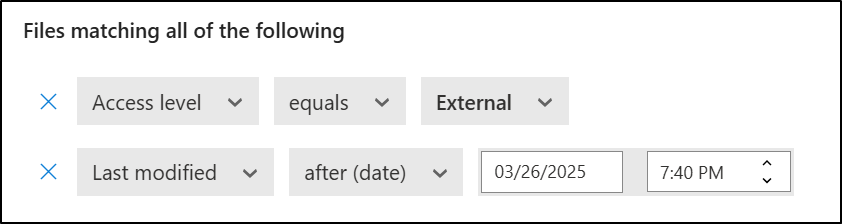

---
lab:
  title: Exercício 3 - Criar e gerenciar rótulos de confidencialidade
  module: Module 1 - Implement Information Protection
---

# Laboratório 1 - Exercício 3 - Criar e gerenciar rótulos de confidencialidade

Joni Sherman, administradora de segurança da informação da Contoso Ltd., está lançando uma estratégia de rotulagem de confidencialidade para ajudar a proteger dados confidenciais em todos os departamentos. Como parte desse esforço, ela está configurando opções de rotulagem manual e automática, subetiquetas e criptografia, incluindo suporte para Criptografia de Chave Dupla (DKE) e integração com o Microsoft Defender para Aplicativos em Nuvem.

**Tarefas:**

1. Habilitar o suporte para rótulos de confidencialidade
1. Criar um rótulo de confidencialidade
1. Criar um subrótulo
1. Publicar os rótulos de confidencialidade
1. Configurar a rotulagem automática
1. Criar e publicar um rótulo DKE para conteúdo altamente confidencial
1. Habilitar a integração do Microsoft Purview no Defender para Aplicativos em Nuvem
1. Criar uma política de arquivos para rotular automaticamente arquivos compartilhados externamente

## Tarefa 1 - Habilitar suporte para rótulos de confidencialidade

Nesta tarefa, você habilitará a coautoria para rótulos de confidencialidade, o que também habilita rótulos de confidencialidade para arquivos no SharePoint e no OneDrive.

1. Ainda é necessário estar conectado à VM Cliente 1 (SC-401-CL1) como a conta **SC-401-CL1\admin** e conectado ao Microsoft Purview como Joni Sherman.

1. Abra o **Microsoft Edge** e nague até `https://purview.microsoft.com`.

1. Na navegação à esquerda, selecione **Configurações** > **Proteção de informações**.

1. Nas configurações** de **Proteção de Informações, verifique se você está na **guia Coautoria para arquivos com rótulos** de confidencialidade.

1. Selecione a caixa de seleção **Ativar coautoria para arquivos com rótulos de confidencialidade**.

1. Selecione **Aplicar** na parte inferior da tela.

Você habilitou com sucesso o suporte a rótulos de confidencialidade para arquivos no SharePoint e no OneDrive.

## Tarefa 2 - Criar um rótulo de confidencialidade

Nesta tarefa, você criará um rótulo de confidencialidade pai para conteúdo interno. Esse rótulo inclui configurações básicas e atua como um rótulo pai para sub-rótulos específicos do departamento.

1. Você ainda deve estar conectado à VM do Cliente 1 (SC-401-CL1) como a conta **SC-401-CL1\admin**.

1. No **Microsoft Edge**, navegue até `https://purview.microsoft.com`.

1. No portal do Microsoft Purview, selecione **Soluções** na barra lateral esquerda e clique em **Proteção de Informações**.

1. Na página **Proteção de informações da Microsoft**, na barra lateral esquerda, escolha **Rótulos de confidencialidade**.

1. Na página **Rótulos de confidencialidade**, clique em **+ Criar um rótulo**.

1. A nova configuração de **Rótulo de confidencialidade** será iniciada. Em **Fornecer detalhes básicos para esse rótulo**, insira:

    - **Nome**: `Internal`
    - **Nome de exibição**: `Internal`
    - **Descrição para usuários**: `Internal sensitivity label.`
    - **Descrição para administradores**: `Internal sensitivity label for Contoso.`

1. Selecione **Avançar**.

1. Na página **Definir o escopo para este rótulo**, selecione **Arquivos** e **E-mails**. Se a caixa de seleção de **Reuniões** estiver marcada, desmarque-a.

1. Selecione **Avançar**.

1. Na página **Escolher configurações de proteção para os itens rotulados**, clique em **Avançar**.

1. Na página **Rotulagem automática para arquivos e emails**, clique em **Avançar**.

1. Na página **Definir configurações de proteção para grupos e sites**, clique em **Avançar**.

1. Na página **Examinar suas configurações e concluir**, selecione **Criar rótulo**.

1. Na página **Seu rótulo de confidencialidade foi criado**, selecione **Não criar uma política ainda** e selecione **Concluído**.

Você criou um rótulo de confidencialidade para uso interno. Esse rótulo atuará como um rótulo pai para sub-rótulos mais específicos usados em diferentes departamentos.

## Tarefa 3 - Criar um sub-rótulo

Agora que você tem um rótulo base, criará um sub-rótulo para documentos relacionados a RH. Esse sub-rótulo inclui configurações de proteção e marcações de conteúdo visível para dar suporte às práticas internas de tratamento de dados para o departamento de RH.

1. Na página **Rótulos de confidencialidade**, localize o rótulo de confidencialidade **Interno** recém-criado. Clique nas reticências verticais (**...**) ao lado do rótulo e clique em **+ Criar sub-rótulo** no menu suspenso.

    

1. O assistente **Novo rótulo de confidencialidade** será iniciado. Na página **Fornecer detalhes básicos para este rótulo**, insira:

   - **Nome**: `Employee data (HR)`
   - **Nome de exibição**: `Employee data (HR)`
   - **Descrição para usuários**: `This HR label is the default label for all specified documents in the HR Department.`
   - **Descrição para administradores**: `This label is created in consultation with Ms. Jones (Head of HR department). Contact her if you need to change the label settings.`

1. Selecione **Avançar**.

1. Na página **Definir o escopo para este rótulo**, selecione **Arquivos** e **E-mails**. Se a caixa de seleção de **Reuniões** estiver marcada, desmarque-a.

1. Selecione **Avançar**.

1. Na página **Escolher configurações de proteção para itens rotulados**, selecione as opções **Controlar acesso** e **Aplicar marcação de conteúdo** e, em seguida, selecione **Avançar**.

1. Na página **Controle de acesso**, clique em **Definir configurações de controle de acesso**.

1. Defina as configurações de criptografia com estas opções:

   - **Atribuir permissões agora ou permitir que os usuários decidam?,**: Atribuir permissões agora
   - **O acesso do usuário ao conteúdo expira**: Nunca
   - **Permitir acesso offline**: Apenas por um número de dias
   - **Os usuários têm acesso offline ao conteúdo por este número de dias**: 15
   - Clique no link **Atribuir permissões**. No painel do submenu **Atribuir permissões**, clique em **+ Adicionar qualquer usuário autenticado** e, em seguida, em **Salvar** para a aplicar esta configuração.

1. Na página **Controle de acesso**, clique em **Avançar**.

1. Na página **Marcação de conteúdo**, selecione a opção para habilitar **Marcação de conteúdo**.

1. Para cada um dos seguintes tipos de marcação, marque a caixa de seleção e selecione o ícone de edição para inserir o texto:

   |Tipo de marcação|Texto|
   |:---|:---|
   |Adicionar uma marca d’água|`INTERNAL USE ONLY`|
   |Adicionar um cabeçalho|`Internal Document`|
   |Adicionar um rodapé|`Contoso Confidential`|

1. Selecione **Avançar**.

1. Na página **Rotulagem automática para arquivos e emails**, clique em **Avançar**.

1. Na página **Definir configurações de proteção para grupos e sites**, clique em **Avançar**.

1. Na página **Examinar suas configurações e concluir**, selecione **Criar rótulo**.

1. Na página **Seu rótulo de confidencialidade foi criado**, selecione **Não criar uma política ainda** e selecione **Concluído**.

Você criou um sub-rótulo que aplica criptografia e marcações de conteúdo a documentos de RH. Esse rótulo ajuda a garantir que os dados de RH sejam acessíveis apenas a usuários autenticados e possam ser identificados por marcações visuais.

## Tarefa 4 - Publicar rótulos de confidencialidade

Agora você publicará o rótulo de confidencialidade interno e de RH para que os rótulos de confidencialidade publicados fiquem disponíveis para os usuários de RH aplicarem aos documentos de RH.

1. Você ainda deve estar conectado à VM Cliente 1 (SC-401-CL1) como a conta **SC-401-cl1\admin** e deve estar conectado ao Microsoft Purview como **Joni Sherman**.

1. No **Microsoft Edge**, a guia do portal do Microsoft Purview ainda deve estar aberta. Se não estiver, navegue até **`https://purview.microsoft.com`** > **Soluções** > **Proteção de Informações** > **Rótulos de confidencialidade**.

1. Na página **Rótulos de confidencialidade**, clique em **Publicar rótulos**.

1. A configuração de publicação dos rótulos de confidencialidade será iniciada.

1. Na página **Escolher rótulos de confidencialidade a serem publicados**, clique no link **Escolher rótulos de confidencialidade para publicar**.

1. No painel do submenu **Rótulos de confidencialidade a publicar**, selecione as caixas de verificação **Interno** e **Dados internos/funcionários (RH)** e, em seguida, selecione **Adicionar** na parte inferior da página do submenu.

1. De volta à página **Escolher rótulos de confidencialidade a serem publicados**, clique em **Avançar**.

1. Na página **Atribuir unidades administrativas**, clique em **Avançar**

1. Na página **Publicar para usuários e grupos**, clique em **Avançar**.

1. Na página **Configurações de política**, clique em **Avançar**.

1. Em **Configurações padrão para documentos**, selecione **Avançar**.

1. Em **Configurações padrão para e-mails**, selecione **Avançar**.

1. Em **Configurações padrão para reuniões e eventos do calendário**, selecione **Avançar**.

1. Na página **Configurações padrão para conteúdo do Fabric e do Power BI**, clique em **Avançar**.

1. Na página **Nomear política**, insira:

   - **Nome**: `Internal HR employee data`

   - **Insira uma descrição para sua política de rótulo de confidencialidade**: `This HR label is to be applied to internal HR employee data.`

1. Selecione **Avançar**.

1. Na página **Revisar e concluir**, clique em **Enviar**.

1. Na página **Nova política criada**, selecione **Concluído** para concluir a publicação da sua política de rótulos.

Você publicou os rótulos de confidencialidade interno e de RH. Pode levar até 24 horas para que as alterações sejam replicadas para todos os usuários e serviços.

## Tarefa 5 - Configurar a rotulagem automática

Nesta tarefa, você criará um rótulo de confidencialidade para dados financeiros e o configurará para ser aplicado automaticamente ao conteúdo que contém identificadores financeiros específicos, como números de cartão de crédito e informações de roteamento bancário.

1. Ainda é necessário estar conectado à VM do Cliente 1 (SC-401-CL1) como a conta **SC-401-cl1\admin**.

1. No **Microsoft Edge**, navegue até`https://purview.microsoft.com` e faça login no portal do Microsoft Purview como **Joni Sherman**.

1. No portal do Microsoft Purview, selecione **Soluções** > **Proteção de informações** > **Rótulos de confidencialidade**.

1. Na página **Rótulos de confidencialidade**, localize o rótulo de confidencialidade **Interno**. Selecione as reticências verticais (**...**) e, em seguida, selecione **+ Criar sub-rótulo** no menu suspenso.

1. Na página **Fornecer detalhes básicos para este rótulo**, insira:

   |Detalhes|Texto|
   |---|---|
   |**Nome**|`Financial Data`|
   |**Nome de exibição**|`Financial Data`|
   |**Descrição para usuários**|`This content contains financial data that must be labeled and protected.`|
   |**Descrição para administradores**|`This label is used for content that includes sensitive financial identifiers.`|

1. Selecione **Avançar**.

1. Na página **Definir o escopo para este rótulo**, selecione **Arquivos** e **E-mails**. Se a caixa de seleção de **Reuniões** estiver marcada, desmarque-a.

1. Selecione **Avançar**.

1. Na página **Escolher configurações de proteção para os itens rotulados**, clique em **Avançar**.

1. Na página **Rotulagem automática de arquivos e emails**, habilite a **Rotulagem automática de arquivos e emails **.

1. Em **Detectar conteúdo que corresponda a essas condições** clique em **+ Adicionar condição** > **O conteúdo contém**.

1. Na seção **Conteúdo contém**, selecione **Adicionar** > **Tipos de informações confidenciais**.

1. Na página do submenu **Tipos de informações confidenciais**, procure e selecione estes tipos de informações confidenciais:

   - `Credit Card Number`
   - `ABA Routing Number`
   - `SWIFT Code`

1. Selecione **Adicionar**.

1. De volta à página **Rotulagem automática para arquivos e emails**, clique em **Avançar**.

1. Na página **Definir configurações de proteção para grupos e sites**, clique em **Avançar**.

1. Na página **Examinar suas configurações e concluir**, selecione **Criar rótulo**.

1. Na página **Seu rótulo de confidencialidade foi criado**, selecione **Aplicar rótulo automaticamente ao conteúdo confidencial** e, em seguida, selecione **Concluído**.

1. Na página do submenu **Criar política de rotulagem automática**, selecione **Revisar política**.

1. Na página **Nomear sua política de rotulagem automática**, deixe o padrão e selecione **Avançar**.

1. Na página **Escolher um rótulo para aplicar automaticamente**, verifique se o rótulo _Dados internos/financeiros_ está selecionado e selecione **Próximo**.

1. Na página **Atribuir unidades administrativas**, clique em **Avançar**.

1. Na página **Escolha os locais onde deseja aplicar o rótulo**, selecione as opções para:

   - Email do Exchange
   - Sites do SharePoint
   - Contas do OneDrive

1. Selecione **Avançar**.

1. Na página **Configurar regras comuns ou avançadas**, deixe a opção padrão **Regras comuns** selecionada e selecione **Avançar**.

1. Na página **Definir regras para conteúdo em todos os locais**, expanda as regras para _Regra de dados financeiros_ para garantir que as regras esperadas estejam definidas e selecione **Avançar**.

1. Na página **Configurações adicionais para e-mail**, selecione **Avançar**.

1. Na página **Decida se deseja testar a política agora ou mais tarde**, selecione **Executar política no modo de simulação** e marque a caixa de seleção **Ativar automaticamente a política se não for modificada após 7 dias na simulação.**

1. Selecione **Avançar**.

1. Na página **Revisar e concluir**, clique em **Criar política**.

1. Na página **Sua política de rotulagem automática foi criada**, selecione **Concluído**.

Você criou com êxito um rótulo de confidencialidade para dados financeiros e configurou uma política de rotulagem automática para detectar e rotular conteúdo que contém informações financeiras confidenciais.

## Tarefa 6 – Criar e publicar um rótulo DKE para conteúdo confidencial

Nesta tarefa, você criará um sub-rótulo no rótulo Interno. Este sub-rótulo utilizará a Criptografia de Chave Dupla (DKE) e marca-d'água dinâmicas para proteger o conteúdo confidencial acessado apenas pelo departamento jurídico. Você também configurará uma política de rótulo que exija justificativa para fazer downgrade do rótulo.

1. Ainda é necessário estar conectado à VM do Cliente 1 (SC-401-CL1) como a conta **SC-401-cl1\admin**.

1. No **Microsoft Edge**, navegue até`https://purview.microsoft.com` e faça login no portal do Microsoft Purview como **Joni Sherman**.

1. No portal do Microsoft Purview, selecione **Soluções** > **Proteção de informações** > **Rótulos de confidencialidade**.

1. Na página **Rótulos de confidencialidade**, localize o rótulo de confidencialidade **Interno**. Selecione as reticências verticais (**...**) e, em seguida, selecione **+ Criar sub-rótulo** no menu suspenso.

1. Na página **Fornecer detalhes básicos para este rótulo**, insira:

   |Detalhes|Texto|
   |---|---|
   |**Nome**|`Highly Confidential - Legal`|
   |**Nome de exibição**|`Highly Confidential - Legal`|
   |**Descrição para usuários**|`Use this label for highly sensitive content that must be encrypted using Double Key Encryption.`|
   |**Descrição para administradores**|`Label configured with DKE and dynamic watermarking for highly sensitive content.`|

1. Selecione **Avançar**.

1. Na página **Definir o escopo para este rótulo**, selecione **Arquivos** e **E-mails**. Se a caixa de seleção de **Reuniões** estiver marcada, desmarque-a.

1. Na página **Escolher configurações de proteção para os tipos de itens selecionados**, selecione **Controlar acesso** e, em seguida, selecione **Avançar**.

1. Na página **Controle de acesso**, clique em **Definir configurações de controle de acesso**.

1. Defina as configurações de criptografia com estas opções:

   - **Atribuir permissões agora ou permitir que os usuários decidam?,**: Atribuir permissões agora

   - **O acesso do usuário ao conteúdo expira**: alguns dias após a aplicação do rótulo

   - **O acesso expira após este número de dias após a aplicação do rótulo**: 5

   - **Permitir acesso offline**: nunca

   - Clique no link **Atribuir permissões**. No painel de submenu **Atribuir permissões**, selecione **+ Adicionar usuários ou grupos**.

   - Na página do submenu **Adicionar usuários ou grupos**, procure e selecione `Legal Team` e `Joni Sherman` e selecione **Adicionar**.

   - Na página **Atribuir permissões**, selecione **Salvar**.

1. De volta à página **Controle de acesso**, marque a caixa de seleção **Usar marca-d'água dinâmica** e selecione **Personalizar texto (opcional)**.

1. Na página **Adicionar texto personalizado à marca d'água (opcional)**, digite`Confidential` e selecione os links para **UPN** e **Carimbo de data/hora**.

1. Selecione **Salvar** na parte inferior da página do submenu.

1. De volta à página **Controle de acesso**, marque a caixa de seleção para **Usar criptografia de chave dupla** e insira `https://testingdke1.azurewebsites.net/Test` como o URL para o serviço de criptografia de chave dupla.

1. Selecione **Avançar**.

1. Na página **Rotulagem automática para arquivos e emails**, clique em **Avançar**.

1. Na página **Definir configurações de proteção para grupos e sites**, clique em **Avançar**.

1. Na página **Examinar suas configurações e concluir**, selecione **Criar rótulo**.

1. Na página **Seu rótulo de confidencialidade foi criado**, clique em **Publicar rótulo nos aplicativos dos usuários** e, em seguida, em **Concluído**.

1. Na página do submenu **Publicar rótulo**, selecione **Criar nova política de rótulo**.

1. Na página **Escolher rótulos de confidencialidade para publicar**, selecione **Escolher rótulos de confidencialidade para publicar** e adicione o rótulo **Altamente confidencial** e o sub-rótulo **Altamente confidencial - Legal**, depois selecione **Adicionar**.

1. Selecione **Avançar**.

1. Na página **Atribuir unidades administrativas**, clique em **Avançar**.

1. Na página **Publicar para usuários e grupos**, deixe a opção padrão selecionada e selecione **Avançar**.

1. Na página **Configurações de política**, marque a caixa de seleção **Os usuários devem fornecer uma justificativa para remover um rótulo ou diminuir sua classificação** e clique em **Avançar**.

1. Na página **Configurações padrão para documentos**, clique em **Avançar**.

1. Na página **Configurações padrão para emails**, clique em **Avançar**.

1. Na página **Configurações padrão para reuniões e eventos do calendário**, clique em **Avançar**.

1. Na página **Configurações padrão para conteúdo do Fabric e do Power BI**, clique em **Avançar**.

1. Na página **Nomear política**, insira:

   - **Nome**: `Highly Confidential - Legal`

   - **Descrição**: `Enables manual use of the DKE label for highly confidential content accessible by Legal.`

1. Selecione **Avançar**.

1. Na página **Revisar e concluir**, clique em **Enviar**.

1. Na página **Nova política criada**, selecione **Concluído**.

Você criou e publicou com êxito um sub-rótulo usando criptografia de chave dupla com marca-d'água dinâmica. Esse rótulo fornece forte proteção para conteúdo altamente confidencial e impõe acesso restrito e justificativa para alterações de classificação.

## Tarefa 7 - Habilitar a integração do Microsoft Purview no Defender para Aplicativos de Nuvem

Nesta tarefa, você habilitará a integração do Microsoft Purview no Microsoft Defender para Aplicativos de Nuvem e ativará o monitoramento de arquivos. Isso permite que o Defender verifique se há rótulos de confidencialidade no Microsoft Purview em arquivos novos e modificados, inspecione o conteúdo com base nesses rótulos e monitore arquivos para que as políticas de arquivo possam ser aplicadas.

1. Ainda é necessário estar conectado à VM do Cliente 1 (SC-401-CL1) como **SC-401-CL1\admin** e ainda estar conectado como Joni Sherman.

1. Abra **o Microsoft Edge** e vá para o **Microsoft Defender** navegando até `https://security.microsoft.com`.

1. Na navegação à esquerda, selecione **Configurações** e, em seguida, selecione **Aplicativos na nuvem**.

1. Na seção **Proteção de informações** no painel esquerdo, selecione **Proteção de informações da Microsoft**.

1. Na página **Proteção de Informações da Microsoft**, selecione as duas caixas de seleção disponíveis na página.

    

   - **Examinar automaticamente novos arquivos em busca de rótulos de confidencialidade da Proteção de Informações da Microsoft e advertências de inspeção de conteúdo**

      Habilita o Defender para Aplicativos em Nuvem a examinar automaticamente arquivos novos ou modificados em busca de rótulos de confidencialidade e advertências de inspeção de conteúdo do Microsoft Purview.

   - **Somente examinar arquivos para rótulos de confidencialidade da Proteção de Informações da Microsoft e advertências de inspeção de conteúdo deste locatário**

      Limita a verificação a rótulos e avisos criados em sua própria organização. Os rótulos aplicados por locatários externos serão ignorados.

1. Selecione **Salvar** para aplicar a configuração.

1. Na seção **Proteção de informações** no painel esquerdo, selecione **Arquivos**.

1. Na página **Arquivos**, clique em **Habilitar monitoramento de arquivos**.

1. Selecione **Salvar** para aplicar a configuração.

Você habilitou o Defender para Aplicativos de Nuvem para verificar arquivos em busca de rótulos de confidencialidade e monitorar arquivos para que as políticas de arquivo possam avaliar e aplicar ações de governança.

## Tarefa 8 - Criar uma política de arquivos para rotular automaticamente arquivos compartilhados externamente

Agora que a verificação de rótulos está habilitada, você criará uma política de arquivo que aplica o rótulo de confidencialidade **Altamente confidencial - Projeto - Falcon** aos arquivos nas pastas do Projeto Mark 8 que são compartilhados fora da sua organização. Essa política é categorizada como DLP porque protege dados confidenciais contra exposição não intencional.

1. No **Microsoft Defender**, navegue até **Aplicativos na nuvem** > **Políticas** > **Gerenciamento de políticas**.

1. Selecione a guia **Proteção de informações** e, em seguida, selecione **Criar política** > **Política de arquivo**.

    

1. Na página **Criar política de arquivo
**, configure:

   - **Nome da política**: `Auto-label external sharing for Project Falcon files`

   - **Gravidade da política**: **alta**

   - **Categoria**: **DLP**

   - **Aplicar a**: **pastas selecionadas**

      - Selecione **Adicionar pasta(s)** e pesquise `Project` no campo Nome do **arquivo**.

      - Marque a caixa de seleção das pastas **Mark 8 Project Team Notebook** e **Mark 8 Project team** do SharePoint.

      - Selecione **Concluído** para fechar a janela **Selecionar uma pasta**.

   - Na seção **Arquivos que correspondem a todos os seguintes**:

      - Para o primeiro filtro, configure as listas suspensas para: **Nível de acesso igual a externo**

      - Para o segundo filtro, configure os menus suspensos para: **Última modificação após (data)** e use a data de hoje

          

   - Em **Ações de governança**, expanda **Microsoft OneDrive for Business**:

      - Selecione a caixa de seleção para **Aplicar rótulo de confidencialidade**

      - No menu suspenso, selecione **Projeto – Altamente confidencial - Falcon**

   - Repita o mesmo processo para o **Microsoft SharePoint Online**

      - Selecione a caixa de seleção para **Aplicar rótulo de confidencialidade**

      - Selecione **Projeto Falcon – Altamente confidencial** no menu suspenso

1. Selecione **Criar** para concluir a criação da política de arquivo.

Você criou uma política de arquivo que aplica um rótulo de confidencialidade altamente confidencial a arquivos compartilhados externamente localizados nas pastas do Projeto Mark 8 no SharePoint e no OneDrive. Depois que um arquivo correspondente for detectado, o Defender para Aplicativos de Nuvem aplicará o rótulo automaticamente.
