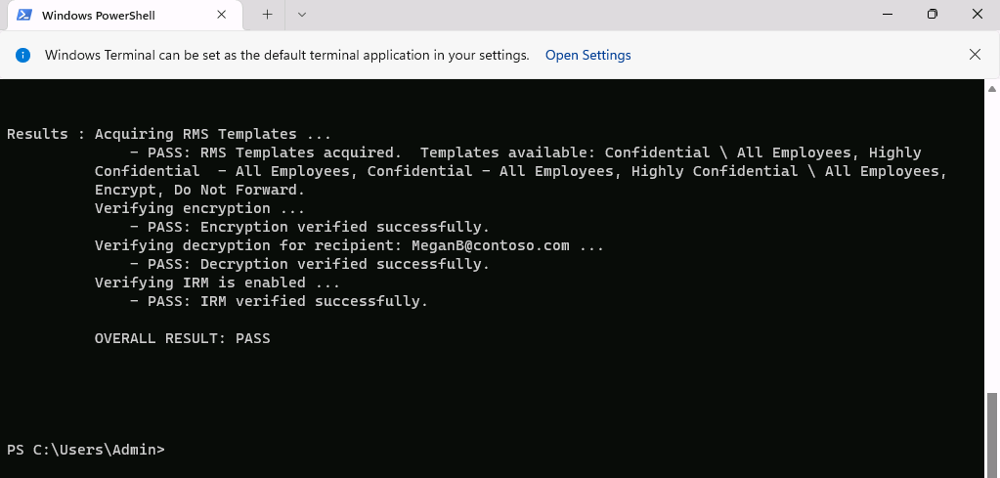
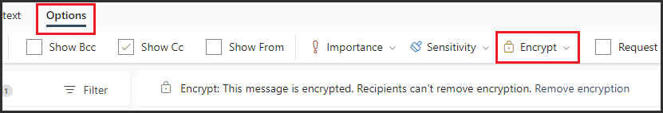

---
lab:
  title: 'Exercício 4: implantar a Criptografia de Mensagens do Microsoft Purview'
  module: Module 1 - Implement Information Protection
---

# Laboratório 1 – Exercício 4: implantar a Criptografia de Mensagens do Microsoft Purview

Joni Sherman, administradora de segurança da informação da Contoso Ltd., foi encarregada de garantir a comunicação segura entre os departamentos. Para auxiliar, ela está configurando a Criptografia de Mensagens do Microsoft Purview para a Contoso, incluindo a modificação das configurações padrão e a criação de uma experiência de identidade visual personalizada para o departamento financeiro.

**Tarefas:**

1. Verificar a funcionalidade do Azure RMS
1. Modificar modelo de identidade visual padrão
1. Validar o comportamento de marca padrão
1. Criar um modelo de marca personalizado
1. Validar o comportamento de marca personalizada

## Tarefa 1: verificar a funcionalidade do Azure RMS

Nesta tarefa, você verificará a funcionalidade correta do Azure RMS do locatário.

1. Você ainda deve estar conectado à VM do Cliente 1 (SC-401-CL1) como a conta **SC-401-CL1\admin**.

1. Abra o PowerShell clicando com o botão direito do mouse no botão Iniciar na barra de tarefas e selecionando **Terminal**.

1. Execute o cmdlet **Install Module** para instalar a versão mais recente do módulo do **PowerShell do Exchange Online**:

    ```powershell
    Install-Module ExchangeOnlineManagement
    ```

1. Confirme a caixa de diálogo Segurança do repositório não confiável com **S** para Sim e pressione **Enter**.  Esse processo pode levar algum tempo para ser concluído.

1. Execute o cmdlet **Connect-ExchangeOnline** para usar o módulo PowerShell do Exchange Online e conectar-se ao seu locatário:

    ```powershell
    Connect-ExchangeOnline
    ```

1. Quando a janela **Entrar** for exibida, entre como `JoniS@WWLxZZZZZZ.onmicrosoft.com` (em que ZZZZZZ é sua ID de locatário exclusiva fornecida pelo provedor de hospedagem de laboratório). Você usará a senha de Joni redefinida em um laboratório anterior.

1. Execute o cmdlet **Get-IRMConfiguration** para verificar se o Azure RMS e o IRM estão ativados em seu locatário:

    ```powershell
    Get-IRMConfiguration | fl AzureRMSLicensingEnabled
    ```

   O resultado **AzureRMSLicensingEnabled** deve ser **True**.

1. Execute o cmdlet **Test-IRMConfiguration** para testar a funcionalidade do Azure RMS usando a Criptografia de Mensagens do Office 365 com **Megan Bowen** como remetente e destinatário:

    ```powershell
    Test-IRMConfiguration -Sender MeganB@contoso.com -Recipient MeganB@contoso.com
    ```

    

    Verifique se todos os testes estão com status PASS e se nenhum erro é mostrado.

1. Deixe a janela do PowerShell aberta.

Você instalou com êxito o módulo Exchange Online do PowerShell, conectou-se ao seu locatário e verificou a funcionalidade correta do Azure RMS.

## Tarefa 2: modificar o modelo de identidade visual padrão

Há um requisito em sua organização para restringir a confiança em provedores de identidade estrangeiros, como Google ou Facebook. Como essas IDs sociais são ativadas por padrão para acessar mensagens protegidas com criptografia de mensagens, você precisa desativar o uso de IDs sociais para todos os usuários em sua organização.

1. Você ainda deve estar conectado à VM do Cliente 1 (SC-401-CL1) como a conta **SC-401-CL1\admin** e ainda deve haver uma janela aberta do PowerShell com Exchange Online conectado.

1. Execute o cmdlet **Get-OMEConfiguration** para exibir a configuração padrão:

    ```powershell
    Get-OMEConfiguration -Identity "OME Configuration" | fl
    ```

   Examine as configurações e confirme se a propriedade SocialIdSignIn está definida como **True**.

    

1. Execute o cmdlet **Set-OMEConfiguration** e restrinja o uso de IDs sociais para acessar mensagens do locatário protegidas com o OME:

    ```powershell
    Set-OMEConfiguration -Identity "OME Configuration" -SocialIdSignIn:$false
    ```

1. Confirme a mensagem de aviso para personalizar o modelo padrão digitando **Y** para Sim e pressione **Enter**.

1. Execute o cmdlet **Get-OMEConfiguration** para verificar a configuração padrão novamente e validar:

    ```powershell
    Get-OMEConfiguration -Identity "OME Configuration" | fl
    ```

    

   Observe que o resultado deve mostrar que SocialIdSignIn está definido como **False**. Deixe a janela do PowerShell e o cliente abertos.

Você desabilitou com êxito os provedores de identidade social, ajudando a garantir que os emails criptografados da Contoso possam ser abertos apenas usando contas da Microsoft ou senhas de uso único, melhorando o controle sobre o acesso a mensagens confidenciais.

## Tarefa 3: validar o comportamento de marca padrão

Você deve confirmar que nenhuma caixa de diálogo de IDs de redes sociais seja exibida para destinatários externos ao receber uma mensagem protegida com Criptografia de mensagem do Office 365 de usuários do seu locatário. Além disso, eles precisam usar a OTP a qualquer momento acessando o conteúdo criptografado.

> [!alerta] A entrega de email externo pode estar bloqueada em alguns ambientes de laboratório. Essa tarefa pode não ser concluída conforme o esperado.

1. Você ainda deve estar conectado à VM do Cliente 1 (SC-401-CL1) como **SC-401-CL1 \admin**.

1. Abra o **Microsoft Edge** em uma janela InPrivate clicando com o botão direito do mouse no Microsoft Edge na barra de tarefas e selecionando **Nova janela InPrivate**.

1. Vá até **`https://outlook.office.com`** e entre no Outlook na Web como `LynneR@WWLxZZZZZZ.onmicrosoft.com` (em que ZZZZZZ é sua ID de locatário exclusiva fornecida pelo provedor de hospedagem de laboratório). A senha de Lynne foi definida em um exercício anterior.

1. Na caixa de diálogo **Permanecer conectado?** selecione a caixa de seleção **Não mostrar novamente** e, em seguida, selecione **Não**.

1. No Outlook na Web, selecione **Novo email**.

1. Na linha **Para** insira seu endereço de email pessoal ou de terceiros que não esteja no domínio do locatário. Digite **`Secret Message`** na linha do assunto e **`My super-secret message.`** no corpo do email.

1. No painel superior, selecione **Opções** e **Criptografar** para criptografar a mensagem. Depois de criptografar a mensagem com sucesso, você verá um aviso que diz "Criptografar: esta mensagem está criptografada. Os destinatários não podem remover a criptografia."

      

1. Selecione **Enviar** para enviar a mensagem. Deixe a janela do Outlook aberta.

1. Faça login em sua conta de e-mail pessoal em uma nova janela e abra a mensagem de Lynne Robbins. Se você enviou esse email para uma conta da Microsoft (como @outlook.com) a criptografia pode ser processada automaticamente e você verá a mensagem automaticamente. Se você enviou o e-mail para outro serviço de e-mail como (@gmail.com), talvez seja necessário executar as próximas etapas para processar a criptografia e ler a mensagem.

    > [!Note] **Observação**: pode ser necessário verificar a pasta de lixo eletrônico ou spam para encontrar a mensagem de Lynne Robbins.

1. Selecione **Ler a mensagem**.

1. Como as IDs de redes sociais estão desabilitadas, você não deve ver uma opção para entrar com uma conta de terceiros.

1. Selecione **Entrar com uma senha de uso único** para receber uma senha de uso único por tempo limitado.

1. Acesse seu portal de e-mail pessoal e abra a mensagem com o assunto **Sua senha de uso único para visualizar a mensagem**.

1. Copie a senha, cole-a no portal do OME e selecione **Continuar**.

1. Revise a mensagem criptografada.

Você testou com sucesso o modelo OME padrão modificado com IDs sociais desativados.

## Tarefa 4 - Criar modelo de marca personalizado

As mensagens protegidas enviadas pelo departamento financeiro da sua organização exigem identidade visual especial, incluindo introdução e textos personalizados e um link de aviso de isenção de responsabilidade no rodapé. As mensagens financeiras também expirarão após sete dias. Nesta tarefa, você criará uma nova configuração personalizada do OME e criará uma regra de transporte para aplicar a configuração do OME a todos os emails enviados do departamento financeiro.

1. Ainda é necessário estar conectado à VM do Cliente 1 (SC-401-CL1) como **SC-401-CL1\admin**, e ainda deve haver uma janela do PowerShell aberta com o Exchange Online conectado.

1. Execute o cmdlet **New-OMEConfiguration** para criar uma nova configuração:

    ```powershell
    New-OMEConfiguration -Identity "Finance Department" -ExternalMailExpiryInDays 7
    ```

1. Confirme a mensagem de aviso para personalizar o modelo com **Y** para Sim e pressione **Enter**.

1. Execute o cmdlet **Set-OMEConfiguration** com o parâmetro _IntroductionText_ para alterar o texto de introdução:

    ```powershell
    Set-OMEConfiguration -Identity "Finance Department" -IntroductionText " from Contoso Ltd. finance department has sent you a secure message."
    ```

1. Confirme a mensagem de aviso para personalizar o modelo com **Y** para Sim e pressione **Enter**.

1. Execute o cmdlet **Set-OMEConfiguration** com o parâmetro _EmailText_ para atualizar o texto do corpo do e-mail criptografado:

    ```powershell
    Set-OMEConfiguration -Identity "Finance Department" -EmailText "Encrypted message sent from Contoso Ltd. finance department. Handle the content responsibly."
    ```

1. Confirme a mensagem de aviso para personalizar o modelo com **Y** para Sim e pressione **Enter**.

1. Execute o cmdlet **Set-OMEConfiguration** com o parâmetro _PrivacyStatementURL_ para alterar o URL do aviso legal para apontar para o site da declaração de privacidade da Contoso:

    ```powershell
    Set-OMEConfiguration -Identity "Finance Department" -PrivacyStatementURL "https://contoso.com/privacystatement.html"
    ```

1. Confirme a mensagem de aviso para personalizar o modelo com **Y** para Sim e pressione **Enter**.

1. Execute o cmdlet **New-TransportRule** para criar uma regra de fluxo de e-mail, que aplica o modelo OME personalizado a todas as mensagens enviadas pela equipe financeira. Esse processo pode demorar alguns segundos para ser concluído.

    ```powershell
    New-TransportRule -Name "Encrypt all mails from Finance team" -FromScope InOrganization -FromMemberOf "Finance Team" -ApplyRightsProtectionCustomizationTemplate "Finance Department" -ApplyRightsProtectionTemplate Encrypt
    ```

1. Execute o cmdlet **Get-OMEConfiguration** para verificar as alterações.

    ```powershell
    Get-OMEConfiguration -Identity "Finance Department" | Format-List
    ```

1. Feche a janela do PowerShell depois de examinar os resultados

Você configurou uma regra de transporte que garante que os emails do departamento financeiro sejam criptografados e marcados de forma consistente, reforçando os padrões de mensagens e segurança da Contoso.

## Tarefa 5 - Validar o comportamento da identidade visual personalizada

Para validar a nova configuração personalizada, você precisa usar a conta de Lynne Robbins novamente, que é membro da equipe financeira.

> [!alerta] Restrições de email externo podem impedir que essa mensagem seja recebida. A identidade visual pode não aparecer conforme o esperado.

1. Volte para **Microsoft Edge** com a janela Outlook InPrivate na web, onde você ainda deve estar conectado como **Lynne Robbins**.

1. Selecione **Novo e-mail** na parte superior esquerda do Outlook na web.

1. Na linha **Para** insira seu endereço de email pessoal ou de terceiros que não esteja no domínio do locatário. Insira**`Finance Report`** na linha de assunto e insira**`Secret finance information.`** no corpo do e-mail.

1. Selecione **Enviar** para enviar a mensagem e feche a janela InPrivate em que você está conectado como Lynne.

1. Entre em sua conta de e-mail pessoal e abra a mensagem de Lynne Robbins.

1. Você deve ver uma mensagem de Lynne Robbins que se parece com a imagem abaixo.  Selecione **Ler a mensagem**.

    

1. Na configuração personalizada, ambas as opções de autenticação estão disponíveis, indicando que a entrada de ID social está habilitada. Selecione **Entrar com uma senha de uso único** para receber uma senha de uso único por tempo limitado.

1. Acesse seu portal de e-mail pessoal e abra a mensagem com o assunto **Sua senha de uso único para visualizar a mensagem**.

1. Copie a senha, cole-a no portal e selecione **Continuar**.

1. Revise a mensagem criptografada com identidade visual personalizada. Feche a janela com sua conta de e-mail aberta.

Você testou o novo modelo personalizado.
