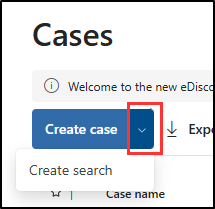

---
lab:
  title: Exercício 2 — Executar uma pesquisa de conteúdo
  module: Module 6 - Audit and search activity in Microsoft Purview
---

## Locatários do WWL – Termos de uso

Se você estiver recebendo um locatário como parte de uma entrega de treinamento com instrutor, observe que o locatário é disponibilizado com a finalidade de dar suporte aos laboratórios práticos no treinamento com instrutor.

Os locatários não devem ser compartilhados ou usados para fins fora dos laboratórios práticos. O locatário usado neste curso é um locatário de avaliação e não pode ser usado ou acessado após o fim da aula e não está qualificado para extensão.

Os locatários não podem ser convertidos em uma assinatura paga. Os locatários obtidos como parte deste curso permanecem a propriedade da Microsoft Corporation e reservamos o direito de obter acesso e a qualquer momento.

# Laboratório 6 — Exercício 2 — Realizar uma pesquisa de conteúdo

Você é Joni Sherman, administradora de segurança da informação da Contoso Ltd. A organização recebeu um alerta de que dados financeiros confidenciais podem ter sido expostos. Foi solicitado que você use o Microsoft Purview para pesquisar conteúdo que contenha os principais termos financeiros nos serviços do Microsoft 365. Seu objetivo é determinar se algum conteúdo sensível foi compartilhado de forma inadequada e apoiar a investigação.

**Tarefas:**

1. Atribuir permissões de Descoberta Eletrônica
1. Pesquisar conteúdo usando termos financeiros confidenciais

## Tarefa 1 — Atribuir permissões de Descoberta Eletrônica

Nesta tarefa, você atribuirá permissões de Descoberta Eletrônica a Joni Sherman para que ela possa executar uma pesquisa de conteúdo no Microsoft Purview.

1. Entre na VM do Cliente 1 (SC-401-CL1) como a conta **SC-401-CL1\admin**.

1. Se tiver entrado como Joni, saia e feche todas as janelas do navegador.

1. No **Microsoft Edge**, navegue até **`https://purview.microsoft.com`** e entre no portal do Microsoft Purview como **Administrador MOD**`admin@WWLxZZZZZZ.onmicrosoft.com` (em que ZZZZZZ é seu ID de locatário exclusivo fornecido pelo provedor de hospedagem de laboratório). A senha de administrador deve ser fornecida pelo seu provedor de hospedagem do laboratório.

1. Na barra lateral esquerda, selecione **Configurações** > **Funções e escopos** > **Grupos de função**.

1. Na página **Grupos de função de soluções do Microsoft Purview**, pesquise por `eDiscovery` e selecione **Gerente de Descoberta Eletrônica**.

1. No painel de submenu **Gerenciador de Descoberta Eletrônica**, selecione **Editar**.

1. Na página **Gerenciar o Administrador de Descoberta Eletrônica**, selecione **Escolher usuários**.

1. Na página de submenu **Escolher usuários**, pesquise `Joni` e marque a caixa de seleção **Joni Sherman**. Clique no botão **Selecionar** na parte inferior do painel.

1. De volta à página **Gerenciar Gerenciador de Descoberta Eletrônica**, selecione **Avançar**.

1. Na página **Gerenciar o Administrador de Descoberta Eletrônica**, selecione **Avançar**.

1. Na página **Examinar o grupo de função e concluir**, selecione **Salvar**.

1. Na página **Você atualizou o grupo de função**, selecione **Concluído**.

1. Saia da conta de Administrador MOD clicando no ícone **MA** no canto superior direito da janela e, em seguida, em **Sair**.

Você atribuiu permissões de Descoberta Eletrônica a Joni Sherman, permitindo que ela pesquise conteúdo confidencial como parte da investigação.

## Tarefa 2 — Pesquisar conteúdo usando termos financeiros confidenciais

1. No Microsoft Edge, navegue até `https://purview.microsoft.com` e entre no portal do Microsoft Purview como **Joni Sherman**`JoniS@WWLxZZZZZZ.onmicrosoft.com` (em que ZZZZZZ é sua ID de locatário exclusiva fornecida pelo provedor de hospedagem de laboratório). A senha de Joni foi definida em um exercício anterior.

1. No Microsoft Purview, navegue até **Soluções** > **Descoberta Eletrônica**.

1. Na página **Casos**, selecione o menu suspenso ao lado de **Criar caso** e, em seguida, **Criar pesquisa**.

   

1. Na caixa de diálogo **Inserir informações para começar**, insira:

   - **Nome do caso**: `Financial Data Exposure Review`
   - **Nome da pesquisa**: `Financial Data Leak Investigation`
   - **Descrição do caso**: `Case opened to support security investigation efforts by identifying potential exposure of sensitive financial terms in Microsoft 365 content.`
   - **Descrição da pesquisa**: `Search targets common high-risk financial keywords to support data security monitoring and policy validation.`

1. Selecione **Criar** para criar a pesquisa.

1. Na página **Investigação de vazamento de dados financeiros**, em **Fontes de dados** selecione **+** (sinal de adição) > **Adicionar fontes de dados**.

   

1. No submenu **Pesquisar fontes**, selecione o grupo **Equipe financeira** e, em seguida, **Salvar e fechar**.

1. No painel **Construtor de condições**, adicione as palavras-chave `bank account` e `credit card` e selecione **Executar consulta**.

   

1. No submenu **Escolher resultados da pesquisa** em **Estatísticas**, marque as caixas de seleção **Incluir categorias** e **Incluir relatório de palavras-chave da consulta** e, em seguida, selecione **Executar consulta**.

1. Para revisar os resultados da pesquisa:

   - Clique na guia **Estatísticas** para exibir um resumo das métricas de pesquisa.
   - Clique na guia **Amostra** para visualizar o conteúdo correspondente.

Você realizou uma pesquisa de conteúdo baseada em palavras-chave para ajudar a identificar se dados financeiros confidenciais foram compartilhados de forma inadequada. Esses resultados respaldam as investigações de segurança e ajudam a orientar a resposta ao risco.
