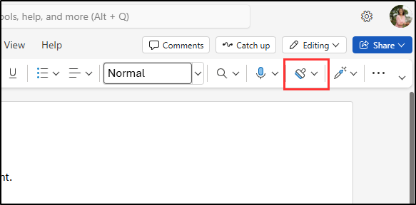

---
lab:
  title: 'Validar políticas de confidencialidade, DLP e retenção'
  module: 'Policy validation - Validate sensitivity, DLP, and retention policies'
---

## Locatários do WWL – Termos de uso

Se você estiver recebendo um locatário como parte de uma entrega de treinamento com instrutor, observe que o locatário é disponibilizado com a finalidade de dar suporte aos laboratórios práticos no treinamento com instrutor.

Os locatários não devem ser compartilhados ou usados para fins fora dos laboratórios práticos. O locatário usado neste curso é um locatário de avaliação e não pode ser usado ou acessado após o fim da aula e não está qualificado para extensão.

Os locatários não podem ser convertidos em uma assinatura paga. Os locatários obtidos como parte deste curso permanecem a propriedade da Microsoft Corporation e reservamos o direito de obter acesso e a qualquer momento.

# Laboratório de validação — Validar políticas de confidencialidade, DLP e retenção

Você é Joni Sherman, Administrador de Segurança da Informação da Contoso Ltd. Agora que você configurou rótulos de confidencialidade, DLP (prevenção contra perda de dados) e políticas de retenção, foi solicitado que você valide se essas configurações estão funcionando conforme o esperado. Neste laboratório, você testará o comportamento de cada política em aplicativos do Microsoft 365 e verificará se o conteúdo está protegido e retido de acordo com suas configurações de política.

**Tarefas:**

1. Aplicar um rótulo de confidencialidade no Word
1. Disparar uma política DLP no Outlook
1. Aplicar rótulos de retenção e confidencialidade no SharePoint

## Tarefa 1 — Aplicar um rótulo de confidencialidade no Word

Nesta tarefa, você verificará se os rótulos de confidencialidade publicados estão disponíveis para os usuários e podem ser aplicados diretamente no Microsoft Word.

1. Você ainda estará na VM do Cliente 1 (SC-401-CL1) como a conta **SC-401-CL1\admin** e estará conectado ao Microsoft 365 como **Joni Sherman**`JoniS@WWLxZZZZZZ.onmicrosoft.com` (em que ZZZZZZ é a ID de locatário exclusiva fornecida pelo provedor de hospedagem de laboratório). A senha de Joni foi definida em um exercício anterior.

1. No Microsoft Edge, selecione o inicializador de aplicativos no canto superior esquerdo e escolha **Word**.

    

1. Selecione **Documento em branco**.

1. Se solicitado, feche a caixa de diálogo **Suas opções de privacidade**.

1. Insira o seguinte texto no documento:

   `Important HR employee document.`

1. Selecione **Sensibilidade** na faixa de navegação e selecione **Interno** > **Dados de funcionários (RH)** para aplicar o rótulo de sensibilidade recém-criado a este documento.

    

    > [!Note] Pode levar de 24 a 48 horas para que os rótulos de confidencialidade recém-publicados estejam disponíveis para aplicação. Se os rótulos de confidencialidade recém-criados não estiverem disponíveis, você poderá usar **Confidencial** > **Todos os Funcionários** para este exercício.

1. Altere o rótulo de confidencialidade para **Público** para verificar se a caixa de diálogo de justificativa comercial é exibida.

1. Selecione **Cancelar** para manter o rótulo de confidencialidade.

1. No canto superior esquerdo do documento, selecione **Documento** para renomear este arquivo e renomeie-o para **`HR Document`**. Pressione Enter para aplicar essa alteração de nome.

    

Você verificou se o rótulo de confidencialidade de RH está disponível e aplica as proteções apropriadas a um documento do Word.

## Tarefa 2 — Disparar uma política DLP no Outlook

Em seguida, você enviará informações confidenciais dos funcionários em um email para verificar se sua política DLP detecta e bloqueia corretamente a atividade.

1. Você ainda deve estar na VM do Cliente 1 (SC-401-CL1) como a conta **SC-401-CL1\admin** e no Microsoft 365 como Joni Sherman.

1. No Microsoft Edge, selecione o inicializador de aplicativos no canto superior esquerdo e escolha **Outlook**.

1. Clique no botão **Novo email** no canto superior esquerdo para redigir uma nova mensagem de email.

1. No campo **Para**, insira `Megan` e selecione o endereço de email de **Megan Bowen**.

1. No campo Assunto, insira `Help with employee information`.

1. No corpo do email, insira:

   ``` text
   Please help me with the start dates for the following employees:
   ABC123456
   DEF678901
   GHI234567

   Thank you, 
   Joni Sherman
   ```

1. Clique no botão **Enviar** no canto superior direito da janela de mensagem para enviar o email.

1. Você receberá uma mensagem informando que não foi possível entreguar o email e que ele foi bloqueado por uma política DLP.

   

Você confirmou que a política de DLP bloqueou a transmissão de IDs confidenciais de funcionários por email.

## Tarefa 3 — Aplicar rótulos de retenção e confidencialidade no SharePoint

Para testar sua configuração de retenção, você aplicará um rótulo de retenção a um documento armazenado no SharePoint e verificará se os rótulos de confidencialidade também estão disponíveis.

1. Você ainda deve estar na VM do Cliente 1 (SC-401-CL1) como a conta **SC-401-CL1\admin** e no Microsoft 365 como Joni Sherman.

1. No Microsoft Edge, selecione o inicializador de aplicativos no canto superior esquerdo e escolha **SharePoint**.

1. Na página de aterrisagem do SharePoint, procure por`Benefits` e selecione **Benefícios @ Contoso** nos resultados da pesquisa.

1. Selecione **Documentos** no painel esquerdo.

1. Na página **Documentos**, selecione as reticências ao lado de **Profit-sharing Plan.docx** e, em seguida, selecione **Detalhes**.

   

1. No painel **Detalhes**, atualize os seguintes campos:
   - **Confidencialidade**: Confidencial - Finanças
   - **Aplicar rótulo**: Registros financeiros confidenciais

     

Você confirmou que os rótulos de retenção e confidencialidade estão disponíveis e podem ser aplicados a documentos do SharePoint.
